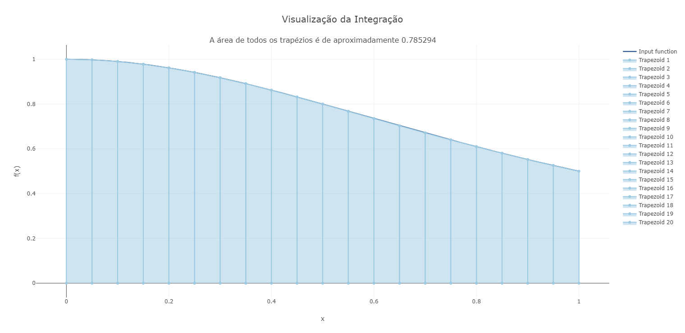

# Método do Trapézio

Esse repositório possui o método do trapézio para solução de integrais univariáveis. Abaixo, temos alguns exemplos de integrais para ilustrar. O código de cada exemplo está em "exemplos.py".

## Exemplo 1

Seja a seguinte integral

$$
\begin{equation}
\displaystyle\int_0^1 \frac{1}{x^2+1} \textrm{ dx}
\end{equation}
$$

Pode-se determinar seu valor exato. Portanto,

**Demonstração:**

### Em desenvolvimento.

**Solução Numérica**

Gráfico da solução numérica.

## Referências

### Em desenvolvimento.
